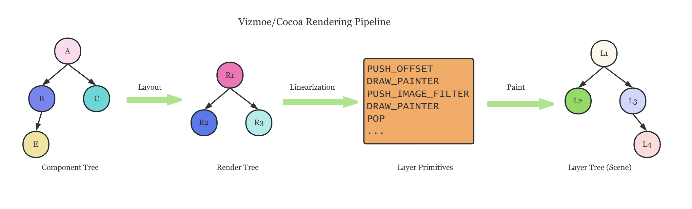

# Cocoa — General-Purposed 2D Rendering Framework for Linux
This project belongs to [OpenACG Group](https://github.com/OpenACG-Group).

わたしわ、高性能ですから！

[Documentations](https://openacg-group.github.io/)

## Motivation & Introduction
Cocoa is a project inspired by
[*ATRI -My Dear Moments-*](https://atri-mdm.com/),
initially aiming to improve the VN experience on the Linux platform and provide
a framework for those who are interested in VN creation.  Although Cocoa is initially
created for VN, it is completely a general-purposed 2D rendering framework that can
fit other similar situations.

The project name **Cocoa** comes from an anime called
[_Is the Order a Rabbit?_](https://www.gochiusa.com/)
which has a heroine named _Kokoa Hoto_. So its pronunciation is actually follows the Japanese
Katakana ココア. But it also doesn't matter much if you pronounce it in English way.

TypeScript is the official programming language of Cocoa. Cocoa itself can be treated
as a JavaScript engine, which is written in C++17.
Rendering framework part of Cocoa is mostly built by native C++,
while the visual novel framework part is completely built by TypeScript.

Cocoa is still being developed and haven't been ready for commercial use.
Issues / Pull requests are welcome.

## Platform
A typical feature of GNU/Linux platform is that there are usually more than one
technique/solution to solve the same problem. For example, both PipeWire and
PulseAudio are designed to be the audio backend on Linux. Some solutions are too
old (but they are usually more stable and compatible, like X11 vs Wayland) and
Cocoa **does not and will not** support them.

Generally, Cocoa always supports the newer technique when we have the choice,
and there is a table showing what are or aren't supported:

| Feature               | Support     | Not support |
|-----------------------|-------------|-------------|
| Display Server        | Wayland     | X11, Mir    |
| Graphics Library      | Vulkan      | OpenGL      |
| Audio Server          | PipeWire    | PulseAudio  |
| Video Decoding Accel. | VAAPI (DRM) | VDPAU       |

* For video decoding acceleration, Vulkan may be supported in the future.

## Build and use Cocoa
See [documentation](https://openacg-group.github.io) for more details.

## Vizmoe/Cocoa Pipeline
The UI framework of Cocoa, which is named __Vizmoe__, is still being developed
and undocumented. Here is a simple chart to show how Vizmoe works with Cocoa.



## Rendering Framework
After building Cocoa successfully, you can run a simple example which renders a star filled with
linear gradient colors.

TypeScript code of that example is like:

```typescript
import * as std from 'core';
import * as GL from 'glamor';

// Geometry size of the window
const WINDOW_WIDTH = 256;
const WINDOW_HEIGHT = 256;

// First of all, initialize Glamor context by providing the name 
// and version of your application for `Initialize` function.
GL.RenderHost.Initialize({
    name: 'Example',
    major: 1,
    minor: 0,
    patch: 0
});

// Now the rendering thread has been started and we can do
// remote method calls based on promise.

// Connect to default display server (Usually Wayland on Linux)
let display = await GL.RenderHost.Connect();

// Create a window with hardware-accelerated rasterization backend
let surface = await display.createHWComposeSurface(WINDOW_WIDTH, WINDOW_HEIGHT);

// Close the display attached to the window when the window is closed.
// We can do this because `surface` is the unique window in this application.
surface.connect('closed', () => {
    display.close();
});

// Dispose the Glamor context when the display is closed
display.connect('closed', GL.RenderHost.Dispose);

// Set a reasonable title for our window
surface.setTitle('White Eternity');

// As the final step of window system related initialization,
// we create a blender so that we can render things through it.
let blender = await surface.createBlender();

// Register a close event callback
surface.connect('close', () => {
    // When the window is notified by system that it should be closed,
    // this callback function will be fired.
    // We just print a message and close the window in this simplest
    // application.
    std.print('Window was closed by user...\n');

    // The invocation of `close` only sends a message to rendering thread,
    // which means it will NOT make the window closed immediately.
    // This request will be processed asynchronously in event loop.
    blender.dispose();
    surface.close();
});

// Now the preparation steps have been done, and we can draw something
// by Skia.

// Create a path. Path is a set of contours which we can stroke along with.
// Closed path can be filled with colors.
function star(): GL.CkPath {
    const R = 60.0, C = 128.0;
    let path = new GL.CkPath();
    path.moveTo(C + R, C);
    for (let i = 0; i < 15; i++) {
        let a = 0.44879895 * i;
        let r = R + R * (i % 2);
        path.lineTo(C + r * Math.cos(a), C + r * Math.sin(a));
    }
    return path;
}

// Draw something on the canvas
function draw(canvas: GL.CkCanvas): void {
    let paint = new GL.CkPaint();
    paint.setPathEffect(GL.CkPathEffect.MakeFromDSL('discrete(10, 4, 12)', {}));

    const shader = GL.CkShader.MakeFromDSL(
        'gradient_linear([0, 0], [256, 256], [[0.26,0.52,0.96,1], [0.06,0.62,0.35,1]], _, %tile)',
        {tile: GL.Constants.TILE_MODE_CLAMP});

    paint.setShader(shader);
    paint.setAntiAlias(true);

    canvas.clear([1, 1, 1, 1]);
    canvas.drawPath(star(), paint);
}

// Record all the drawing operations in a Picture.
// Those drawing operations will be replayed by rasterizer later.
function drawPicture(): GL.CkPicture {
    let recorder = new GL.CkPictureRecorder();
    let canvas = recorder.beginRecording([0, 0, 256, 256]);
    draw(canvas);
    return recorder.finishRecordingAsPicture();
}

// Then build a scene with a single picture layer and submit it to blender.
let scene = new GL.SceneBuilder(WINDOW_WIDTH, WINDOW_HEIGHT)
    .pushOffset(0, 0)
    .addPicture(drawPicture(), false, 0, 0)
    .build();

blender.update(scene).then(() => { scene.dispose(); });
```

## Third Parties
Cocoa depends on many opensource projects and thanks to them give us a more convenient way
to develop Cocoa without suffering.

* [Google Skia - New BSD License](https://skia.org)
* [Google V8 - BSD License](https://v8.dev)
* [Vulkan - Apache License 2.0](https://www.vulkan.org)
* [FFmpeg - LGPL v2.1+ License](https://ffmpeg.org)
* [libuv - MIT License](https://libuv.org)
* ... and other many dependencies
