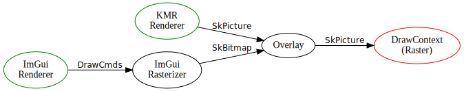
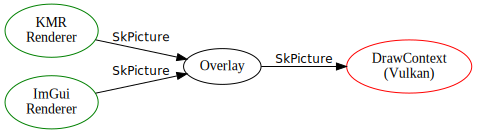

# Vanilla — Multimedia Library
2D Rendering, Hardware Acceleration and Video/Audio Processing

## Introduction
Vanilla 是 Cocoa Project 中最重要的库，实现了大部分图形、多媒体的功能，包括 2D 渲染
（实际由 Skia 实现）、基于 Vulkan 的硬件加速以及音视频流的解码和处理。

## Architecture
Vanilla 依赖于 Cocoa Project 中的底层 Core 库。Core 为 Vanilla 实现了异步事件循环、
带有栈帧回溯的异常处理等功能。在此之上，Vanilla 还使用了如下第三方库：
- `Skia` 库提供了 2D 功能，包括基于 CPU 和 GPU 的光栅化器
- `xcb` 等窗口系统相关库
- `Vulkan` 提供基本的 GPU API

(1) libav 库中的 libswscale 也能够实现同样的功能，但是 Google 的 libyuv
提供了更好的性能。然而 libyuv 并没有实现针对所有可能的 YUV 格式的转换函数，因而 Vanilla
会尽量使用 libyuv 转换，在不得已时使用 libswscale。

Vanilla 的所有源文件在 `src/Vanilla` 目录下，所有的相关对象和类型都在 `cocoa::vanilla`
命名空间下。在下文的描述中，我们默认省略命名空间前缀。

## Concepts
### Memory Management (内存管理)
Vanilla 中的大部分对象需要共享或在多个对象之间互相引用，因而它们大部分都是引用计数的。
例如，一个对象 T 会提供静态成员函数 `T::MakeT(...)`，称为工厂函数
（或按照面向对象程序设计的术语称作工厂方法），它通常返回一个`Handle<T>` 对象，
它实质是 C++ 中的智能指针 `std::shared_ptr<T>`，
使用该返回对象的方法和原则和 C++ 智能指针的用法相同。

### Graphics Context (图形上下文)
`Context` 类是 Vanilla 库的一个实例（或称为 Vanilla 上下文），
一个 Cocoa 进程仅包含一个 Vanilla 实例（若用户在 JavaScript 中尚未创建对应的实例，
则此时的 Cocoa 进程不包含任何 Vanilla 实例）。`Context` 维护了一个 `Display`
链表和一个 `PaConnection` 实例，前者的每一个元素对应一个到显示服务器（如 X11 Server）
的连接，后者对应到 pulseaudio 音频服务的连接。

通过 `Context` 获得 `Display` 对象。通过 `Display` 对象，可以创建多个 `Window` 对象，
每个 `Window` 对象对应一个窗口实例。

在 `Window` 对象上有唯一的 `DrawContext` 对象与之关联。`DrawContext`
对应一个光栅化器实例，有不同的后端可以选择——基于 CPU 光栅化的 `RasterDrawContext`
和基于 GPU 的 `VkDrawContext`，后者使用 Vulkan (API>=v1.2) 实现了硬件加速绘制。
`DrawContext` 最终提供 Skia 库的 `SkSurface` 对象。

### Signal and Slot (信号和槽)
一些传统的 GUI API 使用基于事件的架构来完成显示服务器和应用程序之间的交互。Vanilla
中则使用名为信号和槽 (Signal and Slot) 的机制来完成同样的事情，
但信号槽机制相比事件系统要更加简洁明了和易于使用。

在信号槽机制中，__信号 (signal)__ / __槽 (slot)__ 是两个核心概念。
信号是事件 (event) 的抽象，
事件代表一个异步任务系统中来自事件发送方的某种通知（在这个例子中是显示服务器的通知）。
一个事件通常是一个单独的对象，但信号（在逻辑层面上）不是一个对象，
它更应当被视为其所属对象的一种属性，同时信号自身也应当描述对应事件的全部属性。
槽类似于回调函数，多个槽可以被连接 (connect) 到同一个信号上，当一个信号被 emit 时，
连接到该信号上的所有槽函数都会被调用。

需要特别注意的是，槽函数被调用的顺序是不确定的，
因此用户在使用信号槽机制时，不应当设计任何依赖于槽函数调用顺序的算法或业务逻辑。


## Window-based Rendering
在上一章节中已经简要介绍了图形上下文以及与之相关的对象，
在这一章中我们将具体介绍如何基于 Vanilla 进行 2D 渲染。具体的类和方法接口规范请参见 API 文档。
```cpp
#include <iostream>

#include "include/core/SkCanvas.h"

#include "Core/Exception.h"
#include "Core/Journal.h"
#include "Core/EventLoop.h"
#include "Vanilla/Context.h"
#include "Vanilla/Display.h"
#include "Vanilla/Window.h"
#include "Vanilla/DrawContext.h"

// 不建议在实际工程中如此使用
using namespace cocoa;
using namespace vanilla;

int main(int argc, const char **argv)
{
    // 创建事件主循环和日志对象
    // PersistentObject 和 EventLoop 的用法参见对 Core 库的说明
    Journal::New();
    EventLoop::New();

    // scope epilogue (作用域尾声) 用于在离开作用域时正确析构一些对象
    ScopeEpiligue ep([]() -> void {
        EventLoop::Delete();
        Journal::Delete();
    });

    // 创建 Vanilla 上下文
    auto context = Context::Make(EventLoop::Instance(), Context::Backend::kXcb);

    // 连接到默认的显示服务器
    context->connectTo(nullptr, 1);
    if (!context->hasDisplay(1))
    {
        // 在实际工程中应使用 Journal 提供的日志功能来打印错误
        std::cout << "Failed to connect to display server" << std::endl;
        return 1;
    }
    auto display = context->display(1);

    // 在 (0, 0) 创建 800x600 大小的窗口，设置一些属性
    auto window = display->createWindow({800, 600}, {0, 0});
    window->setTitle("Vanilla Example");
    window->setResizable(false);

    // 创建 DrawContext (CPU 光栅化)
    auto dc = DrawContext::MakeRaster(window);
    // 要创建基于 GPU 光栅化的 DrawContext:
    // auto dc = DrawContext::MakeVulkan(window);

    // 只有 show() 方法被调用后，窗口才会真正被显示
    window->show();

    // 连接到信号

    // Repaint 信号通知我们窗口应当被重绘
    window->signalRepaint().connect([&dc](const Handle<Window>& win, const SkRect& region) -> void {
        // DrawContext 需要我们通知一帧绘制何时开始，何时结束
        // ScopedFrame 可以基于 RAII 完成此事
        DrawContext::ScopedFrame scope(dc, region);
        SkCanvas *pCanvas = scope.surface()->getCanvas();
        // 在 pCanvas 上绘图。关于如何在 SkCanvas 对象上进行 2D 绘图，参阅 Skia 文档
    });

    // Close 信号通知我们窗口关闭
    window->signalClose().connect([&timer](const Handle<Window>& win) -> void {
        win->close();
        // Display 的 dispose() 方法可以断开与显示服务器的连接，然后主循环会自动结束并退出
        win->getDisplay()->dispose();
    });

    // 在任何时候调用 window->update() 可以更新窗口内容（重绘窗口）
    // 届时连接到 Repaint 信号的槽会被调用

    // 运行事件循环
    EventLoop::Instance()->run(); // 或 EventLoop::Ref().run();
    return 0;
}
```

## Pipeline Based Rendering
Vanilla 提供基于 Pipeline（管线/流水线）的渲染方式，对于一条合法的渲染管线，
我们有如下规定：
1. 渲染管线必须是一张 DAG（有向无环图）；
2. DAG 中必须包含至少一个入度为 0 的结点（称为源结点），至少一个出度为 0 的点（称为终结结点）；
3. 从任意源结点出发，经过若干结点，必须有至少一条有限长度的路径能够到达一个终结结点。

对于 DAG 中的每一个结点，我们用术语元素（Element）描述（尽管它们在效果上更接近于 Effector）；
对于 DAG 中的每一条边，我们用术语连接（Linkage）描述。
一个 Element 通常对应某种变换，如绘制、混合、裁切、模糊滤镜等，
Linkage 描述了数据的传输方向，而整个 DAG 实际上描述了数据如何在若干变换算法中传输，
即 DAG 是变换（算法）的组合，整个 DAG 本身也应当被视作一种变换（算法）。
如下图：

</img>
</img>

