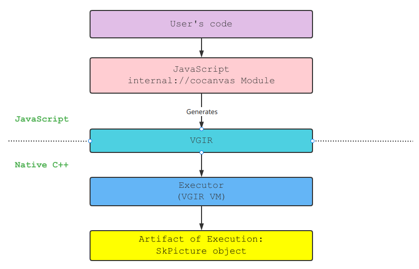

Vector Graphics Intermediate Representation
===========================================
An internal representation of transforms and drawing operations.

## Design Goal

- To provide a general interface of rendering
- An isolation between JavaScript rendering and native rendering
- To reduce context switching from JavaScript to C++ (avoid calling native functions)
- To bring convenience for debugging and reproduction

## Pipeline
总的来说，Cocoa 的 2D 渲染管线分为两个阶段（Stage），
即 __绘图阶段（Paint Stage）__ 和 __光栅化阶段（Rasterization Stage）__.
VGIR 只在绘图阶段发挥作用，其最终目的是产生 `SkPicture` 对象。
Cocoa 的整个绘图框架是基于 Skia 的，包括光栅化部分，而 VGIR 的本质功能就是将 JavaScript
层产生的绘图指令转化为 Skia 绘图指令时的一种中间表示。VGIR 代码是 JavaScript
层绘图引擎的产物（Artifact），同时也是原生绘图层的输入，经由 VGIR 虚拟机对 VGIR
中间代码进行执行，得到 `SkPicture` 对象。该对象包含了翻译后的 VGIR 代码。
这一过程可以用下图表示：



实际上，此图已经完整地描述了 Cocoa 2D 渲染管线的绘图阶段。

## Structure
VGIR 是由一条条的线性的指令（Instruction）构成的，指令又由操作码（Opcode）
和操作数（Operand）组成。

大部分指令没有显式的操作数，这是因为 VGIR 是一种基于栈的中间表示，
这些指令已经隐含了对栈上的数据进行操作这一语义。栈上可以容纳多种类型的数据，
包括 __标志量（Flags）__, __标量（Scalar）__，__向量（Vector）__，
以及 __矩阵（Matrix）__。标志量实际上一种特殊的整数，它有确定的用途，我们将在后文介绍。

### Basic Stack Operations
__栈（stack）__ 是 VGIR 的核心，它为所有指令提供暂存操作数和结果的空间。
由于 VGIR 的设计中不存在寄存器，所以栈是唯一的一级存储单元。

使用 `push` 指令可以且仅可以将某个标量入栈，`pop` 指令则可以使任何数据出栈。
`redundant` 指令可以将目前的栈顶数据复制一份，然后将该复制后的数据入栈。
`exchange` 指令可以交换栈顶和次栈顶的数据，在实现层面，
该指令直接交换栈顶和次栈顶对应对象元素的指针，没有任何除指针赋值外的数据拷贝。
可以证明，不存在仅包含 `push`，`pop` 和 `redundant` 的指令序列，与 `exchange` 的功能等价。

上述指令是直接对栈进行操作的，其它指令大抵上也遵循「从栈顶开始取出 N 个元素，
进行某种变换后将结果重新入栈」这一基本规律。因此，指令可以看作是对栈的一种变换。
VGIR 中的很多指令都是无副作用（Side Effect）的，这意味着，除了对栈进行操作外，
它们不会更改任何其它数据。

### Stack with Heap
__堆（Heap）__ 不同于栈，它可以容纳更多类型的数据，且这些数据是持久化存储的。
所有合法的栈对象，都是一个合法的堆对象。此外，堆还可以存储字符串和不透明对象，
这将在下文介绍。堆中的任何元素都可以用一个 32 位无符号整数来唯一标识，
这类似于 C/C++ 中的指针，你可以把这个整数看作对应堆元素的「内存地址」，
但是在 VGIR 中，我们更倾向于称它为 __引用（Reference）__。

使用 `store %x` 指令可以将当前栈顶元素复制一份，然后存入堆中，整数 `x` 是该元素的引用。
`load %x` 从堆中加载引用 `x` 指向的堆元素，如果目标堆元素不能在栈中表示，
将引发 `#LoadInvalidHeapObject` 异常。`free %x` 从堆中销毁 `x` 指向的元素，
该指令执行后，`x` 变为无效引用，可以被 `store` 指令复用。对于用户来说，
不必为每个堆中的对象都手动使用 `free` 指令，VGIR VM 会在程序结束后自动回收堆中的元素。

此外，使用 `heapclear` 可以清空堆中所有的元素。

### Basic Drawing Operations
VGIR 有大量的绘图指令，而根据 Skia 的绘图模型，我们将 2D 绘图过程抽象为几个基本操作对象：
* Canvas（画布）：指定绘图结果将输出到哪里，一段 VGIR 程序有固定不变的绘图目标；
* Paint：指令绘图的颜色、抗锯齿、线宽、shader 等参数；
* Path（路径）：描画一段 2D 图线所要经过的路径，例如直线、圆、椭圆、贝塞尔曲线等；

Canvas 包含两个最重要的属性：
* Matrix（矩阵）：画布上的坐标变换；
* Clip（裁切）：将绘图操作限制到某区域，区域外的内容会被忽略。

Paint 包含了很多内容：
* Shader（着色器）：给定一个坐标，可以输出一个颜色值的程序片段；
* Blend（混合）：将要绘制的内容和 Canvas 上的原有内容如何混合；
* ColorFilter（颜色滤镜）：要对绘制内容应用何种颜色变换；
* PathEffect（路径效果）：要对绘制的路径应用何种变换；
* More...

整个 2D 绘图的最终一步，可以被概括为两种类型：
* Stroke（描画）：从某个出发点开始，描画一段或多段路径（直线或曲线），直到终点；
* Fill（填充）：用特定颜色（纯色或从着色器取色）填充某个闭合平面区域。

### Basic Arithmetic Operations
算术操作是针对标量而言的，所有算术操作的对象都是标量。VGIR 实现了这些基本算术操作：
（a 为次栈顶，b 为栈顶）

| Opcode        | Description           |
|---------------|-----------------------|
| `add`         | `a + b`               |
| `sub`         | `a - b`               |
| `mul`         | `a * b`               |
| `div`         | `a / b`               |
| `rem`         | `a % b`               |
| `inc`         | `b + 1`               |
| `neg`         | `-b`                  |
| `sqrt`        | `sqrt(b)`             |
| `rsqrt`       | `1 / sqrt(b)`         |
| `fastrsqrt`   | `1 / sqrt(b)`         |
| `pow2`        | `b ^ 2`               |
| `sin`         | `sin(b)`              |
| `cos`         | `cos(b)`              |
| `tan`         | `tan(b)`              |
| `sincos`      | `sin(b) * cos(b)`     |
| `sincosb`     | `sin(a) * cos(b)`     |

`rsqrt` 和 `fastrsqrt` 都可以实现平方根倒数运算，不同的是，
`rsqrt` 是标准算法，它先求出操作数的平方根，然后在求出它的倒数。
而 `fastrsqrt` 是一种快速平方根倒数算法，它比标准算法快很多，
但是在精度上有所损失。一般而言，`fastrsqrt` 的结果可以精确到小数点后三位。

上述指令，一些需要两个栈元素，称为 __二元操作符（Binary Operator）__，
而只需要一个栈元素的称为 __一元操作符（Unary Operator）__。

__所有的二元操作符，会将两个操作数出栈，然后将结果入栈；所有的一元操作符，__
__会将一个操作数出栈，然后将结果入栈。__
这意味着，这些指令会破坏栈中的操作数，然后用算术结果代替它们。

要保留原操作数，可以借助一些指令来辅助：
```asm
# Stack: [x, y]

exchange            # [y, x]
store       %1      # [y, x]
exchange            # [x, y]
redundant           # [x, y, y]
load        %1      # [x, y, y, x]
exchange            # [x, y, x, y]
```
