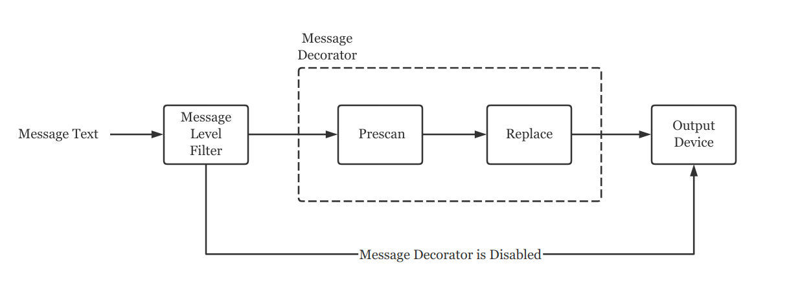

Infrastructure - Journal Logging System
=======================================
基础架构之 Journal 日志系统

## Overview
Journal 是一个简单的 C++ 日志系统实现，支持日志输出级别控制、日志存储和简单的语法着色功能。
在 `src/Core/Journal.h` 文件中定义了 `QLOG(...)` 宏可以用于直接输出日志。

Journal 的输出格式为：
```
[ <TIMESTAMP> ][<LEVEL>:<PID>] <<MODULE>> <CONTENT>
```

`<TIMESTAMP>` 为该条日志记录的时间戳，是一个整数部分 5 位、小数部分 6 位的小数，单位为秒，
表示从日志系统初始化开始到当前日志所经历的时间，日志系统初始化的时间可以近似为 Cocoa 启动的时间。
`<LEVEL>` 是这条日志的级别，可以是 debug, info, warn, error 中的任意一个。
`<PID>` 是调用 `QLOG` 宏的进程的 PID，Linux 平台下没有所谓线程的概念，线程与进程的界限是模糊的，
因而线程也具有不同的 PID。所以尽管 Cocoa 本身是单进程架构，PID 仍然可以用来标识不同的线程输出的日志。
`<MODULE>` 是一个模块名，Cocoa 中模块代表着一个独立的 C++ 源文件，该字段可以用来定位输出日志的 C++ 文件。
`<CONTENT>` 是日志内容。


## Module Name
要使用 `QLOG` 输出日志，必须在对应的源文件中定义 `THIS_FILE_MODULE` 宏，该宏内容将作为日志输出中的
`<MODULE>` 字段。在 Cocoa 中，模块名类似于文件路径，有多个层级，用句点 `.` 来分隔，
且一定以 `Cocoa.` 开头表示 Cocoa 内部的模块，其完整写法应该是 `org.OpenACG.Cocoa.`，
但是为了控制长度便简写为 `Cocoa.` 字符串。模块名严格按照源文件所在的路径进行书写，例如，位于
`src/Glamor/HWComposeContext.cc` 文件应该具有模块名 `Cocoa.Glamor.HWComposeContext`。

`src/Journal.h` 中已经提供了一个 `COCOA_MODULE_NAME` 宏，可以简便地生成一个 Cocoa 模块记号，
用法如下：
```cpp
#define THIS_FILE_MODULE COCOA_MODULE_NAME(Glamor.HWComposeContext)
```

宏展开后为：
```cpp
#define THIS_FILE_MODULE "Cocoa.Glamor.HWComposeContext"
```

对于那些处于 Cocoa 源码树之外的模块（例如第三方 [语言绑定](../runtime/language_bindings.md)），
可以有自己的命名方法，但是最好不要使用与 Cocoa 官方模块名不协调的命名规范。例如：
```cpp
// Good!
#define THIS_FILE_MODULE "QuickVN.Scenario.OnePassParser"

// Bad!
#define THIS_FILE_MODULE "quick_vn.scenario.one_pass_parser"
```

## Message Processing
通过 `QLOG` 输出的消息并不会立刻就打印的标准输出或者指定的输出文件中，而是经过一系列处理之后再输出，
这一过程如图所示：


## Level Filter
每条消息都具有特定的日志级别，用于表示该消息的紧急或严重程度，Cocoa 支持这些级别：
+ `LOG_DEBUG` 调试消息，用于追踪程序运行情况；
+ `LOG_INFO` 通知消息，程序报告运行状态和参数；
+ `LOG_WARNING` 警告消息，可能导致程序出错但是还不至于引发严重错误；
+ `LOG_ERROR` 错误消息，程序出错，一些功能已经不能正确运行；
+ `LOG_EXCEPTION` 致命性错误消息，程序出错，且无法从错误状态中恢复，将打印栈回溯消息然后退出。

上述消息级别按优先级从低到高排列，`Journal` 类在创建时，必须指定一个日志记录的级别，
这个级别用于去过滤消息，那些优先级低于该级别的消息将被过滤掉，不会输出。

这便是上图中「Message Level Filter」阶段所做的事。

## Message Decorator
__消息装饰器（Message Decorator）__ 是在消息体中使用的一种特殊语法，
类似于 `printf` 系列函数的格式化字符串，使用装饰器，可以控制消息展示在控制台中时的一些属性，
例如文字颜色、斜体、高亮、闪烁效果等。装饰器的语法描述如下：
```
%<specifier>[<arg 1, arg2, arg3, ...>]
```
其中，`speicifer` 是一个只包含字母和数字的合法标识符。

装饰器就像一个格式化标志，最终会被替换为其指定的内容。

装饰器分为有参和无参两种，有参装饰器必须在尖括号中指明规定数量的参数，如 `%bar<par1,par2>`；
对于无参装饰器而言，`%foo` 和 `%foo<>` 都是有效的语法，后者主要用于显示地去结束一个 `speicifer`。
由于装饰器是和消息体混杂在一起的，所以对于 `specifier` 的分离比较困难，
对于消息体 `From %pid: now is %timestamp` 而言，分离出 `%pid` 和 `%timestamp` 并不算困难，
但是对于消息体 `%fg<re>Hello%resetWorld` 而言，对第二个 `%` 后的 `specifier` 的解释就会有多种可能。
因此，`%foo<>` 这种语法是专门针对无参装饰器的消歧义语法，上述消息体写成 `%fg<re>Hello%reset<>World`
就没有歧义了。

Cocoa 目前支持的装饰器并不多，但涵盖了日志输出的几乎所有需求，如下（标注有 `?` 的是可选参数）：

| Decorator         | Description
|-------------------|-------------
| `%disable`        | 对后续内容禁用装饰器解释器，直到遇到 `%enable`
| `%enable`         | 对后续内容启用装饰器解释器，默认为启用
| `%timestamp`      | 替换内容为时间戳，该时间戳与 Overview 中介绍的 `<TIME>` 字段内容含义一致
| `%reset`          | 取消所有的 ASCII 转义符的效果，相当于 `\033[0m`
| `%fg<color, ...>` | 替换为 ASCII 转义符相应的前景颜色
| `%bg<color>`      | 同 `%fg`，但是设置背景色
| `%italic`         | 替换为 ASCII 转义符的斜体设置，相当于 `\033[3m`
| `%pid`            | 替换为当前进程（线程）的 PID
| `%tid`            | 替换为当前线程的 TID

## Processing Message Decorator
在 Cocoa 内部，对消息装饰器的解析是分两步的，__预扫描（Prescan）__ 和 __替换（Replace）__，
上述两步统称为 __翻译（Translation）__。

预扫描阶段借助词法分析的一些手段，从消息体中提取出装饰器，这一过程将会将一条消息字符串分割为若干片段，
每一个片段称为一个 __词法单元（Token）__，Token 有两种，一种是只有纯文本的，称为 __消息片段（Fragment）__，
另一种只含有装饰器，就称为 __装饰器（Decorator）__。

例如，如下消息体：
```
Argument %italic<>%fg<ye>'bitmap'%reset must be an instance of CkBitmap
```
会被这样分割：
1. FRAGMENT `Argument `
2. DECORATOR `%italic<>` [specifier=italic]
3. DECORATOR `%fg<ye>` [specifier=fg, arguments=ye]
4. FRAGMENT `'bitmap'`
5. DECORATOR `%reset` [specifier=reset]
6. FRAGMENT ` must be an instance of CkBitmap`

上述 Token 会按顺序被包装为一个列表，作为替换阶段的输入。

在第二阶段中，消息片段将被直接输出，而装饰器会被替换为相应的内容。

## Usage in JavaScript Land
`Journal` 日志系统 API 已通过 `introspect` 机制暴露给 JavaScript 层，但是有权限控制。
更加详细的信息，请参见 `introspect` 部分的文档。
