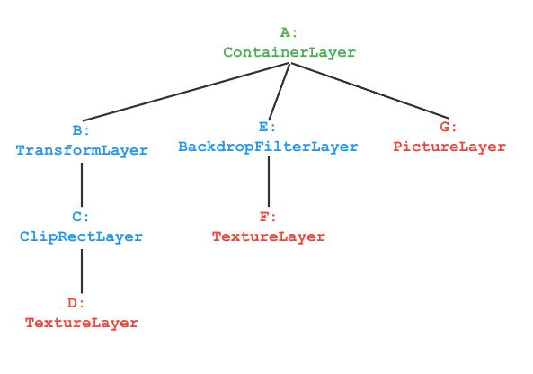
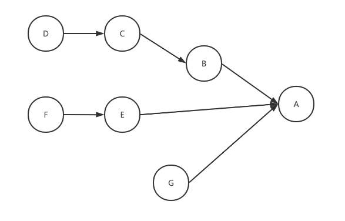

Cocoa 2D Rendering Pipeline - Rasterization
===========================================
Cocoa 2D 渲染流水线 - 光栅化阶段

## Overview
Cocoa 2D 渲染管线大体上可分为两个部分，__绘制（Paint）__ 和 __光栅化（Rasterization）__.
绘制阶段主要在 JavaScript 层完成，负责生成一系列的绘制指令和图层；而光栅化阶段则全部在 C++ 层完成.

绘制阶段以 __场景（Scene）__ 为最终目标，将通过 `SceneBuilder` 生成一个 `Scene` 对象，
然后调用 `Blender.updateScene` 方法，可以更新目标窗口上的帧. 对场景的改动会生成新的帧，
每一帧都会导致 `Scene` 对象的重建，而 `Blender` 对象会小心地比较前后新旧 `Scene` 对象的差异，
并计算出出需要更新的最小矩形区域，该矩形区域称为 __绘图边界（Paint Boundary）__ 或 __脏矩形（Dirty Rectangle）__
区域. 另外，调用 `Scene.toImage` 方法可以获得 `Scene` 对象光栅化后的像素图（`CkImage` 对象），
由 `Scene.toImage` 引起的光栅化和 `Blender.updateScene` 引起的光栅化是完全独立的，但二者都是异步的.

`Blender.updateScene` 引起的光栅化是延迟进行的，它会在合适的时机在窗口上呈现新的帧，如果硬件加速可用的话，
它也会尽量使用 GPU 来加速光栅化过程. `Scene.toImage` 引起的光栅化在线程池中进行，即 JavaScript
无需等待光栅化完成，只需谨慎地处理它返回的 `Promise` 对象即可. 与前者不同，`Scene.toImage` 光栅化总是基于 CPU
的，`Scene` 包含的绘制指令中若有对 GPU 资源的引用（如纹理对象等），光栅化时这些资源将会从 GPU 内存中复制到 CPU 内存，
这也将导致 `Scene.toImage` 光栅化比较慢.

## Scene and Layer Tree
在界面绘制中，不免会涉及元素之间的层叠关系，为此我们将其抽象为 __图层（Layer）__. 与 Photoshop
等工具中图层的概念不同，Cocoa 的图层可以不包含像素，甚至可以不包含能够生成像素的元素.
在 Cocoa 中，图层具有这些性质：
1. 图层按照一定的顺序层叠放置，将多个图层合并为最终图像的过程称为 __混成（Composite）__；
2. 图层要么本身具有像素[^1]，要么具有描述像素的内容[^2]，也可以不包含任何上述内容（称为不可绘制图层）；
3. 若图层不包含任何可绘制内容，那它可以对邻近图层产生某种影响，如线性变换、透明度、滤镜等；
4. 图层以树形结构组织，一个图层可以包含若干个子图层. 

[^1]: 例如纹理图层.
[^2]: 这可以理解为，此类图层本身不包含像素，但是可以通过光栅化生成像素，例如Picture图层.

若一个图层还可以包含子图层，那么它必定是一个 `ContainerLayer`. `ContainerLayer` 是一个不可绘制图层，
它类似于一个容器，可以对子图层施加某种变换. 另一方面，可绘制图层是不能有子图层的，即，在一棵图层树中，
可绘制图层一定是叶子节点，不可绘制图层 `ContainerLayer` 一定是非叶子节点，特别规定，
图层树的根节点是一个空的 `ContainerLayer`[^3].

[^3]: 「空的」并不意味着它没有子节点，而是在说，它不会对子图层施加任何变换.

在 C++ 层，`Layer` 是所有图层的基类，`ContainerLayer` 继承自 `Layer`，接下来，所有的不可绘制图层都继承自
`ContainerLayer`，所有的可绘制图层都直接继承自 `Layer`. 

接下来，我们以一个实例来进一步说明图层树如何工作. 考虑这样一个图层树：


可以看到，所有的叶子节点都是可绘制结点，而蓝色和绿色标记的都是不可绘制节点.
我们按树的后序遍历来遍历该树，得到节点序列：
```
D C B F E G A
```

我们为每个节点创建一个假想的画布，然后依次读取该序列表示的结点，如果遇到可绘制结点，就立即绘制其内容，
如果遇到不可绘制节点，就对当前画布应用该节点指定的变换，然后将所有子结点从左至右依次绘制到它的画布上. 
于是，我们得到如下绘制步骤：
1. D: 绘制纹理到 D 画布
2. C: 绘制 D 画布到 C 画布，使用剪切变换
3. B: 绘制 C 画布到 B 画布，使用指定的线性变换（矩阵）
4. F: 绘制纹理到 F 画布
5. E: 绘制 F 画布到 E 画布，使用指定的 filter
6. G: 绘制 `SkPicture` 到 G 画布
7. A: 绘制 B, E, G 画布到 A 画布

上述流程与 Cocoa 中真实发生的绘制过程有很大差异（毕竟我们不会真的为每个节点都创建画布），但是结果是一样的.
这为我们理解和分析图层树的工作机理提供了充分的理论依据. 另外，如果将树中的每一条边替换为由子节点指向父节点的箭头，
我们就得到一张 DAG（有向无环图），通过该 DAG 同样可以分析图层树的渲染流程：



这张图非常清晰地展示了像素的流向（Flow），类似于编译原理中的数据流分析，我们可以通过该 DAG 来优化图层树结构. 
即，通过一系列等效变换，简化图层树结构. 

Cocoa 并不会对图层树进行任何优化，这需要用户在创建图层树（见下文中 `SceneBuilder` 类）时注意这些问题. 
一些参考优化手段如下：
* 冗余变换合并（Combination of Redundant Transformations, CRT）：
多个 TransformLayer 顺次连接时可以考虑合并为一个 TransformLayer；
* 不透明区域消除（Opaque Region Elimination, ORE）：
OpacityLayer 导致某个图层被完全不透明的图层 __完全遮盖__，可以直接不绘制该图层（即避免 Overdraw）；
* 不透明区域裁剪（Opaque Region Clipping, ORC）：
OpacityLayer 导致某个图层被完全不透明的图层 __部分遮盖__，可以考虑插入 ClipRectLayer. 
* ...

最后，有了图层树我们就能够完整地描述一帧的所有内容了，Glamor 模块会谨慎地处理图层树，并按照规范将它们光栅化、
混成. 我们把一棵图层树进一步包装为一个 __场景（Scene）__，对应 JavaScript 中的 `Scene` 对象，用 `SceneBuilder`
可以构建场景. 

## Two-Stage Rasterization of Layer Tree
接下来我们将介绍图层树的具体光栅化过程，即 __二阶段光栅化（Two-Stage Rasterization）__.

之所以称为「二阶段光栅化」，是因为在光栅化过程中 Cocoa 会对图层树进行 __两次遍历__.
第一次遍历称为 __Preroll__，在这一阶段中，我们主要完成两个工作，计算最小绘制边界和进行光栅化缓存的准备.

某些情况下可能还会有一些 profiling 数据的收集等零碎工作.
计算 __最小绘制边界（Minimal Boundary of Painting）__ 是 Preroll 阶段最重要的工作，
它经过计算生成一个矩形，在第二阶段的 __光栅化（Rasterization）__ 工作中用于剪切全局画布，防止绘制不可见区域.

需要注意的是，所有以图层树为主体的光栅化，不论它们由谁来执行，都会经历二阶段光栅化的过程.
即，`Blender.updateScene` 和 `Scene.toImage` 都会进行二阶段光栅化.

对于那些经历了数帧而内容始终没有任何变化的图层，我们会为其生成光栅化缓存，若在下一帧中该图层内容仍然没有变化，
我们将直接使用光栅化缓存而不对该图层重新光栅化. 光栅化缓存是指将某图层单独进行光栅化，
进而得到一张完全独立的像素纹理图的过程.
