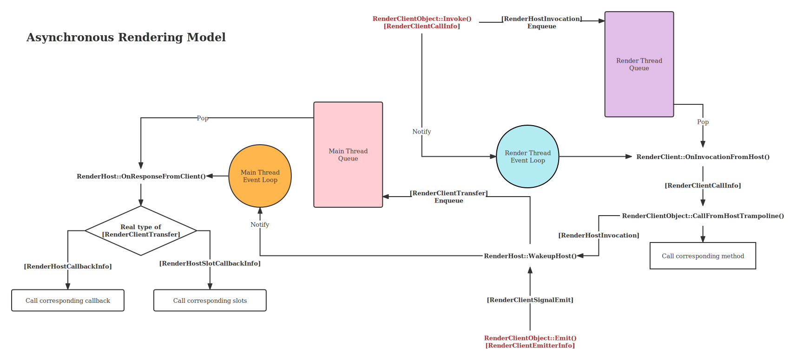

Pipeline: Rendering Thread
==========================
渲染线程

## 1. Overview
Cocoa 是一个多线程程序，除了由 libuv 启动的线程池外，Cocoa 中最为重要的线程可能就是
__渲染线程（Rendering Thread）__ 了。
渲染线程负责了所有图形资源的获取、管理和释放，并实现了一系列异步渲染 API 和信号槽机制。
在 Cocoa 中，一切渲染相关的任务都由渲染线程异步执行，主线程无须等待渲染过程结束，同时，
所有用户输入事件都由渲染线程处理，并以信号量（并非 POSIX 中定义的信号量）的形式通知主线程。

总而言之，渲染线程实现了两个功能，异步渲染 API 和图形资源管理，
接下来我们将从这两方面来介绍渲染线程。

## 2. Asynchronous Operations

### 2.1. Concepts
我们首先介绍一些概念，在后文中会使用到：

* __操作（Operation）__: 指由主线程发起的函数调用，该调用并不会立刻执行，而是被提交到消息队列中，
在合适的时候会被渲染线程执行。操作的执行结果也会放回消息队列中，在合适的时候被主线程读取。

* __信号（Signal）和槽（Slot）__: 操作是由主线程主动发起的函数调用，而信号则是由渲染线程发起的一种通知机制。
函数对象可以连接（Connect）到一个信号上，这些函数就称为槽。当一个信号被发出（Emit）时，
所有连接到该信号的槽都会被调用，顺序不作保证，我们仅保证槽会在信号被接受的那个线程上被调用（通常是主线程）。

* __RenderHost__: 主线程的一方称为 __RenderHost__，相对应的，渲染线程的一方称为 __RenderClient__。

### 2.2. Infrastructure
实现异步 API 的基础是可靠的线程间通讯机制。GLAMOR 使用了 libuv 的 async handle
配合消息队列来实现线程间通讯。这一套机制比较复杂，下图基本阐明了它的工作原理：

如图所示，渲染线程和主线程都分别有自己的事件循环和消息队列。红色字体标记的是可以引起整个流程的操作，
分别是主线程进行异步函数调用的 `Invoke` 函数和渲染线程发出信号的 `Emit` 函数。

当 `Invoke` 函数被调用时，在主线程上将调用相关的所有信息包装为 `RenderHostInvocation` 对象，
并将其推入渲染线程的消息队列，接着立刻通知渲染线程的事件循环。完成这些工作后，`Invoke` 函数返回。
这是异步函数调用的调用阶段。

在渲染线程中，事件循环负责调度来自主线程的通知，在合适的时候会触发渲染线程上的处理函数 `OnInvocationFromHost`，
接着该函数从消息队列中取出 `RenderHostInvocation` 对象，根据其中传递来的信息调用真正的处理函数，
处理函数完成后，`RenderHostInvocation` 的状态被更新（存入返回状态和返回值），
通过 `WakeupHost` 函数将更新后的对象推入主线程的消息队列（此时 `RenderHostInvocation` 被
转换为基类类型 `RenderClientTransfer`），并立即通知主线程的事件循环。
这是异步函数调用的返回阶段，也称为响应（Response）。

对于信号量，也遵循类似的过程，由 `Emit` 函数将有关信号的所有信息包装为 `RenderClientSignalEmit`
对象，然后同样由 `WakeupHost` 函数将该对象推入主线程的消息队列，并立即通知主线程的事件循环。

同样，主线程的事件循环也会在合适的时机调用对应的处理函数 `OnResponseFromClient`，
该函数将判断从消息队列取出的 `RenderClientTransfer` 对象的类型，并分别调用对应的函数来处理。

对于异步函数调用的返回数据，将从 `RenderClientTransfer` 中解出数据，转移到 `RenderHostCallbackInfo`
中，该对象将直接被传递给用户在调用时注册的用于接收返回值的回调函数。

对于信号量，将从 `RenderClientTransfer` 中解出数据，转移到 `RenderHostSlotCallbackInfo` 中，
该对象将直接被传递给用户注册的槽函数。

